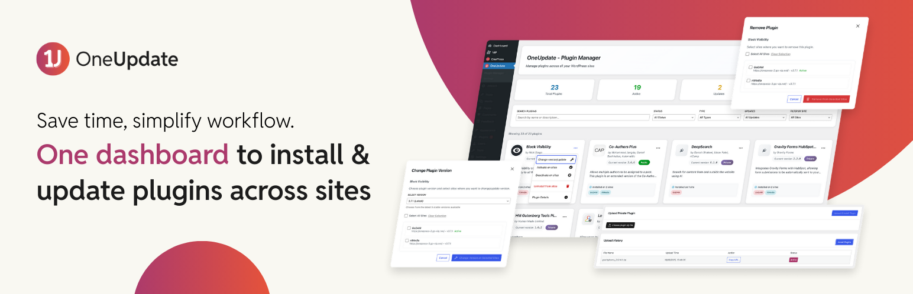

# OneUpdate \- WordPress Plugin Management for Enterprise

**Contributors:** [rtCamp](https://profiles.wordpress.org/rtcamp), [up1512001](https://github.com/up1512001), [danish17](https://github.com/danish17), [AnuragVasanwala](https://github.com/AnuragVasanwala), [aviral-mittal](https://github.com/aviral-mittal), [rishavjeet](https://github.com/rishavjeet), [vishal4669](https://github.com/vishal4669), [SushantKakade](https://github.com/SushantKakade)

**Tags:** OnePress, WordPress, Plugin Manager, CI/CD, WordPress Automation, WordPress Plugins

This plugin is licensed under the GPL v2 or later.

## Overview

OneUpdate is a centralized plugin management solution designed for enterprises managing multiple WordPress sites through CI/CD workflows (like GitHub Actions). It streamlines plugin updates, installation, and management across multiple environments (development → staging → production) by automatically creating pull requests for all changes.

## Description

**OneUpdate** is a centralized plugin manager for WordPress. From a single governing site, you can:

* **Install, update, and downgrade** plugins (with access to the latest 5 versions).  
* **Activate, deactivate, and uninstall** plugins across multiple sites.  
* Manage **public plugins** from WordPress.org and **private plugins** uploaded securely to your S3 instance.

This makes it easier to keep plugins consistent, secure, and up to date across all your WordPress environments.

## Why OneUpdate?

Managing plugin updates in a network of standalone sites in enterprise environments, where updates need to flow through multiple environments (develop → preprod → production), is a highly inefficient process. This can also lead to tech drift — brand sites diverging to such a level that managing them requires separate teams and effort.

OneUpdate solves this by:

- **Centralizing Management:** Single governing to manage plugins on all brand sites  
- **Automating PR Creation:** Automatically creates pull requests for all environments  
- **Maintaining Git History:** Uses single branch from base branch to prevent commit conflicts  
- **Enterprise-Ready:** Built specifically for CI/CD-based WordPress deployments

### Key Benefits

- **Reduced effort:** Significantly reduce plugin management effort and time  
- **Streamlined workflows:** Centralized management while maintaining site autonomy  
- **Stack consolidation:** Helps brands converge on to a common stack of plugins, increasing compatibility and reusability  
- **Cost reduction:** Ultimately, reduced efforts and reduced time \= cost reduction

## Features

### Core Functionality

- **Intuitive Plugin Browser:** Admin interface with advanced search and filtering options  
- **Real-time Status Monitoring:** Up-to-date information about plugin version and status  
- **Scalable Architecture:** Handles both public (available on [WordPress.org](https://wordpress.org/plugins/)) and private plugins  
- **Dual Architecture Support:** Works with WordPress multisite and standalone installations  
- **Secure API Integration:** REST API with unique authentication keys for safe operations

### Plugin Management Actions

- **Bulk Operations:** Update all plugins across multiple sites simultaneously  
- **Version Control:** Install specific versions from the latest 5 available releases  
- **Site-Specific Actions:** Activate, deactivate, install, or uninstall on selected sites  
- **Private Plugin Support:** Upload and manage proprietary plugins  
- **Automated PR Creation:** Generate pull requests for all changes across environments

## System Requirements

| Requirement | Version |
| :---- | :---- |
| WordPress | \>= 6.5 |
| PHP | \>= 7.4 |
| Tested Up to | \>= 6.8.2 |
| Stable Tag | 1.0 |
| Prerequisites | CI/CD managed sites (GitHub/GitLab/Bitbucket) |

## Installation & Setup

For detailed installation instructions, system requirements, and step-by-step configuration guides, please see our comprehensive [**Installation and Setup Guide**](./docs/INSTALLATION.md).

## Usage Guide

### Accessing the governing

Navigate to **OneUpdate → Plugin Manager** in your WordPress admin to access the centralized management interface.

### Plugin Management Actions

#### Plugin Activation/Deactivation

- Click the **3 dot menu** next to any plugin  
- Select **"Activate on sites"** or **"Deactivate on sites"**  
- Choose target sites and confirm

#### Version Management

- Select **"Change version/update"** from the plugin menu  
- Choose from the latest 5 available versions  
- Select target sites for the update

#### Plugin Removal

- Select **"Uninstall from sites"** from the plugin menu  
- Choose sites for plugin removal  
- Confirm the action

#### Installing New Plugins

**Public Plugins:**

1. Click **"Add Plugin"** button  
2. Select **"Public Plugin"**  
3. Search any WordPress.org plugin  
4. Choose version and target sites

**Private Plugins:**

1. Click **"Add Plugin"** → **"Private Plugin"**  
2. Upload plugin ZIP file  
3. Select installation sites  
4. Note: Uploaded files expire after 1 hour

#### Bulk Operations

- Use **"Update All"** to update all available plugins  
- Applies only to WordPress.org plugins with available updates

### Filtering and Search

- **Filter by Status:** Active, inactive, or update available  
- **Filter by Site:** View plugins for specific sites  
- **Filter by Type:** Public or private plugins  
- **Search:** Search by plugin name and description

## Development & Contributing

OneUpdate is actively developed and maintained by [rtCamp](https://rtcamp.com/).

- **Repository:** [github.com/rtCamp/OneUpdate](https://github.com/rtCamp/OneUpdate)  
- **Contributing Guide:** [docs/CONTRIBUTING.md](./docs/CONTRIBUTING.md)  
- **Development Guide:** [docs/DEVELOPMENT.md](./docs/DEVELOPMENT.md)

We welcome contributions\! Please read our contributing guidelines before submitting pull requests.

### Workflow Overview

1. **Setup Phase:** Install OneUpdate on governing site and all brand sites, then register brand sites with the governing site  
2. **Plugin Management:** Administrator manages plugins through the governing site dashboard  
3. **Source Integration:** Plugins are sourced from WordPress.org (public) or S3 (private)  
4. **Automation:** GitHub Actions workflows automatically create pull requests across all environments  
5. **Deployment:** Changes flow through your CI/CD pipeline (dev → staging → production)

## Frequently Asked Questions

### How are plugins managed?

Plugins are managed using a combination of GitHub Actions and WordPress REST APIs with comprehensive security checks.

### Can I install plugins directly from GitHub?

Yes, plugins installed directly via GitHub will be tracked on the governing site, even if not added through OneUpdate.

### Are there limits on plugin management?

There are no hard limits on the number of plugins you can manage from the governing site.

### Can I remove plugins from specific sites?

Yes, you can remove plugins from specific sites directly through the dashboard.

### How long do private plugins remain available?

Private plugin uploads expire after 1 hour for security purposes. You'll need to re-upload if you want to use them after expiration.

## Troubleshooting

### Plugin Not Showing on the governing site

- Verify governing site configuration  
- Check network connectivity between sites  
- Confirm REST API permissions

### Search Not Working

- Search functionality covers plugin names and descriptions only  
- Author names and other properties are not searchable

### Pull Requests Not Created

- Ensure GitHub workflows are properly configured:  
  - `oneupdate-pr-creation.yml`  
  - `oneupdate-pr-creation-private.yml`  
- Verify GitHub PAT token permissions  
- Check repository access rights

### Common Issues

- **API Connection Failures:** Verify authentication keys and network connectivity  
- **S3 Upload Errors:** Check S3 credentials and bucket permissions  
- **Workflow Failures:** Review GitHub Actions logs for specific error details

## Support & Community

- **Issues & Bug Reports:** [GitHub Issues](https://github.com/rtCamp/OneUpdate/issues)  
- **Feature Requests:** [GitHub Discussions](https://github.com/rtCamp/OneUpdate/discussions)  
- **Documentation:** [Project Wiki](https://github.com/rtCamp/OneUpdate/wiki)

## License

This project is licensed under the GPL v2 or later \- see the [LICENSE](http://LICENSE) file for details.

---

**Made with ❤️ by [rtCamp](https://rtcamp.com/)**  
